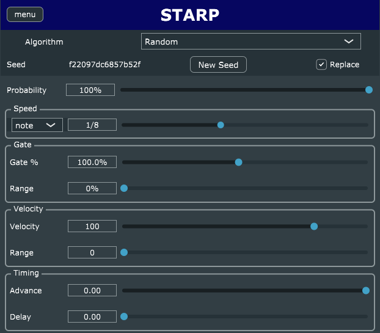
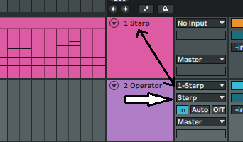
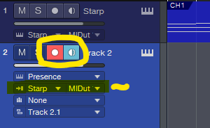
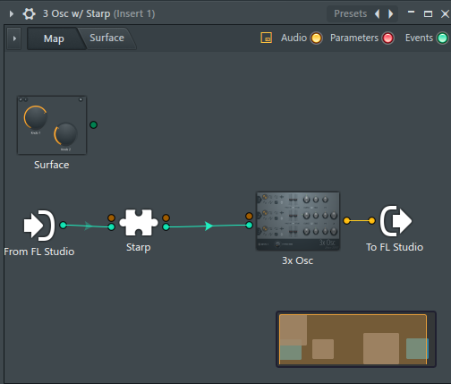
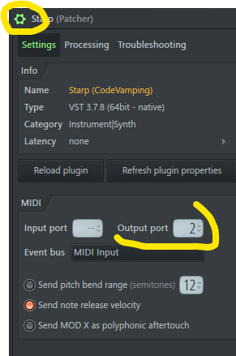
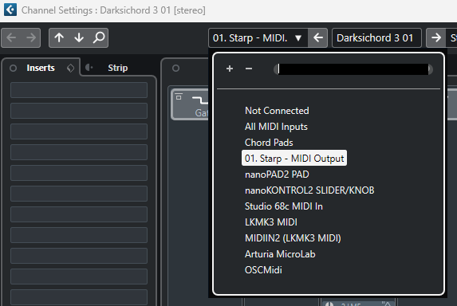

# solidArp

Stable Arpeggiator VST

**NEW** A [User Manual](docs/USER_MANUAL.md) is available

Most random arpeggiators do not give you the same pattern every time through.

This one does.

You can get it to randomize the velocity and gate as well. THose patterns will
also be stable.

Two other sets of algorithms are available:

- Linear - Up, Down, Zigzag
- Spiral - In, Out, InOut, OutIn

## Building

See [BUILDING doc](docs/BUILDING.md)

## Install From Release

These instructions assume you are installing from the provided release builds.
If you build it yourself, the instruction will be similar. The needed files will
under the `${BUILD}/Source/Starp_artefacts/Release/VST3`

### Windows

_Note_ The release builds only work on 64bit windows.

Unzip the file Starp-win-vx.x.x.zip. Place the resulting `Starp.vst3` file into
`C:\Program Files\Common Files\VST3`

### Linux

_Note_ The release builds only work on x86_64 architecture.

Unzip the file Starp-linux-vx.x.x.zip. Place the resulting `Starp.vst3`
directory into `~/.vst3`

This can also be placed in `/usr/local/lib/vst3` for system-wide use. You will
need superuser privileges to do so.

### MacOS

Work in Progress

## Usage in DAW

If a DAW does not appear below, it has not been tested.

### Reaper 6,7

Put it in the Track FX list ahead of the synth.

### Ableton Live 11

Live does not recognize MIDI effects. So, to use this, you will need two tracks.

1. The track with the MIDI and _Starp_.
1. The track with the synth.

Set the input of the Synth track to be the track with _Starp_ . In the second
drop down, choose _Starp_ itself (not Pre FX or Post Fx) as the input.

### Studio One 6

Studio One does not allow you to use 3rd party MIDI effects in the Note FX
slots. Set up is similar to Ableton Live

_Note_ Record Arm must be on or the MIDI will not reach the synth. Yes, this is
painful for no good reason.
[Go Vote](https://answers.presonus.com/43595/add-support-for-third-party-note-fx)
to change this.

### FL Studio 21

FL does not recognize MIDI effects. The easiest way to set this up is using
patcher.

1. Add a patcher to the instrument bank with whatever synth/instrument you want.
1. Add _Starp_ to the patcher and hook it up (it should look like the below).
   **NOTE** Add it from the synth subsection of the plugin menu, not the effects
   subsection.
1. Double Click on the _Starp_ instance and the use the cogwheel in the top-left
   to set the midi output port. Exact port number does not matter.

### Cubase 12

Similar to the Ableton Live set up, you will need two tracks. Be sure to route
the midi from the track with _Starp_ on it to the instrument track (See below).

_Note_ Record Arm must be on or the MIDI will not reach the synth.

## Technology

- [TinySHA1](https://github.com/mohaps/TinySHA1/)
- [JUCE](https://juce.com/)

## License/Copyright

solidArp - Stable Random Arpeggiator Plugin Copyright (C) 2023 Solid Fuel

This program is free software: you can redistribute it and/or modify it under the
terms of the **GNU General Public License** as published by the Free Software
Foundation, either version 3 of the License, or (at your option) any later
version. This program is distributed in the hope that it will be useful, but
WITHOUT ANY WARRANTY; without even the implied warranty of MERCHANTABILITY or
FITNESS FOR A PARTICULAR PURPOSE.

See [the license file](LICENSE) for more details.
