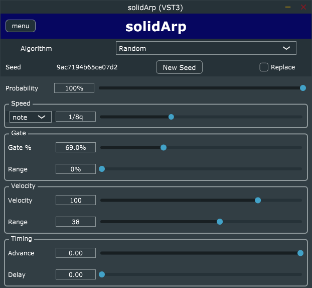

# solidArp

Stable Arpeggiator VST

**NEW** A [User Manual](docs/USER_MANUAL.md) is available

Most random arpeggiators do not give you the same pattern every time through.

This one does.

You can get it to randomize the velocity and gate as well. Those patterns will
also be stable.

Two other sets of algorithms are available:

- Linear - Up, Down, Zigzag
- Spiral - In, Out, InOut, OutIn

## Building

See [BUILDING doc](docs/BUILDING.md)

## Installing

See [Installation Guide](docs/INSTALLATION_GUIDE.md)

## Technology

- [TinySHA1](https://github.com/mohaps/TinySHA1/)
- [JUCE](https://juce.com/)
- [DocTest](https://github.com/doctest/doctest)

## License/Copyright

solidArp - Stable Random Arpeggiator Plugin Copyright (C) 2023 Solid Fuel

This program is free software: you can redistribute it and/or modify it under the
terms of the **GNU General Public License** as published by the Free Software
Foundation, either version 3 of the License, or (at your option) any later
version. This program is distributed in the hope that it will be useful, but
WITHOUT ANY WARRANTY; without even the implied warranty of MERCHANTABILITY or
FITNESS FOR A PARTICULAR PURPOSE.

See [the license file](LICENSE) for more details.
