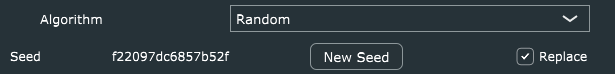
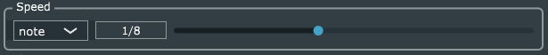
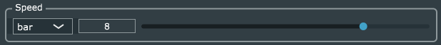
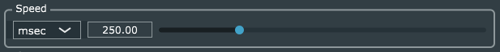
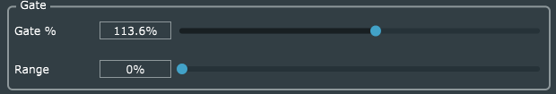
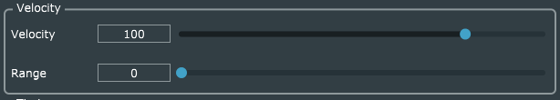
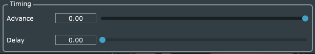

# solidArp _V0.3.0_ User Manual

**solidArp** is a powerful arppegiator that is a
little different from others.

In Random mode _solidArp_ will make sure that the
sequence generate - while indeed random - is stable.
If the midi data doesn't change during successive 
playbacks, the sequences generated will not change.

## Header

The `menu` button on the left contains the `about` menu option to display
version, copyright, and other information about the software.

## Algorithm

The algorithm section consists of two rows. The top row allows you to pick the
algorithm. The bottom row contains options specific to the algorithm.

**NOTE**: None of the settings in this section are automatable in the host and
will not show up in the parameters list.

### Random Algorithm

This algorithm is the reason the plug-in exists. Most random arpeggiators will
give you a different sequence of notes each tme you play through the track.
_solidArp_ will give you the exact same (random) sequence each time you play -
assuming there is no changes to e.g. the MIDI data or BPM, etc.

The algorithm does its best to make sure that the same note is not played twice
in a row.

#### Seed

This is the value used to initialize the random number generator that selects
tones. It is saved as a part of the configuration when you save your project in
your DAW. It is displayed as information only.

#### New Seed Button

When pressed, this button will generate a new seed.

_Note_ : There is currently no way to return to a previous seed. So be sure to
save your project if you want to be able to get back to the previous seed.

#### Replace

By default, the random algorithm will not play a note that it has already played
until all currently sounding notes have been played (choice without
replacement).

When the options is on (check mark in the box) this will no longer be the case.
Each time it must choose a note, it will choose from the full range of notes
currently being played (choice with replacement).

In either case, the set of notes it will choose from will be refreshed every
time the midi data changes.

### Linear Algorithm

#### Up / Down

These button set the primary direction for the arpeggiation. When `Up` is
selected, the arp will start at the lowest note and work up. If `Down` is
selected, the arp will start at the highest note and work down.

#### Zigzag

When selected, the arp will go both up **and** down. The starting direction is
set by the Up/Down radio buttons.

The zigzag does not repeat the note in the middle. So, if `Up` and `Zigzag` are
chosen, the highest note will not be repeated in the middle of the sections.

#### Restart

By default, the sequence runs continuously in the background. If there are no
notes being played, then the plugin creates no midi data, but the sequence is
still running.

When `Restart` is selected, the sequence will restart every time the midi notes
change.

### Spiral Algorithm

#### Primary Note Selection

These radio buttons set whether the top or bottom note is the first (for `In`) or
last (for `Out`) note in the sequence. For the `InOut` and `OutIn` sequences,
these set both the starting and the ending note.

#### Sequence Selection

These radio buttons set which of 4 sequences to generate.

**In** The sequence starts on the Primary Note and "spirals in" to the center.

**Out** The sequence starts on the center note and "spirals out" to the Primary
Note.

**InOut** The `In` and `Out` sequences are performed back-to-back. _note_: The
center not is **not** repeated - but the primary note will be as the sequence
restarts.

**OutIn** The `Out` and `In` sequences are performed back-to-back. _note_: The
center not is **not** repeated - but the primary note will be as the sequence
restarts.

## Parameters

All setting in this section are automatable by the host and can be controlled
via a MIDI controller. See the Appendix for the names of the parameters and how
they map to controls in the plug-in.

Each of the sliders in this section work the same way. You can change the value
by
- Grabbing the slider knob and moving it along the track.
- Clicking in the track to move the slider knob to that location.
- Double click in the track to return the slider knob to the
  default value.
- Clicking on the box that shows the value and typing in a new value.
- Scrolling the mouse wheel while the mouse pointer is on the slider track.

For those sliders that have continuously variable values, a "Fine Adjustment"
mode is available by holding down `Cmd/Ctrl` while dragging the slider knob.

### Probability

Sets the chance that a note will be played. Ranges from 0% (never) to 100%
(always). The default setting is 100%.

Note that sequences are advanced even if a note is not played.

### Speed

There are three ways to specify the speed of the arpeggiation.

- Note value
- Bar division
- Millisecond

#### Note Value

Speed is specified as a Note Value - `1/8` means eighth note, etc. The following
suffixes are used to modify the base value:

| Suffix | Meaning                                      |
| ------ | -------------------------------------------- |
| d      | Dotted - the value is 150% of the base value |
| t      | Triplet - the value is 66% of the base value |
| q      | Quintuplet - the value 80% of the base value |

Faster timings are on the left and slower on the right.

_solidArp_ uses data from both the BPM of the track and the time signature to
compute the actual length.

For the whole note values ('1/1', '1/1t', '1/1q') the length of the note is
equivalent to 4 quarters notes _not_ a bar. So, if the time signature is 3/4,
then `1/1` will last for longer than a measure.

#### Bar Divisions

Speed is specified as the number of notes to place in a measure.

Faster timings are on the left and slower on the right.

Fine Adjustment mode is available but rather pointless.

_solidArp_ uses data from both the BPM of the track and the time signature to
compute the actual length.

As an example, if you are in 3/4 time signature and select `4`, there will be 4
notes generated during a single measure and each note will last the same as a
dotted eighth note.

The timing slots in this mode always start at the beginning of the measure as
indicated by the DAW. If you select `1` but the midi information starts on beat
3 of a measure, the first note generated by the sequence will be on beat 1 of
the next measure.

#### Milliseconds

Speed is specified as the number of Milliseconds from the start of one note to
the next.

Faster timings are on the left and slower on the right.

Fine Adjustment mode is available.

The timing slots in this mode start from the beginning of the project and do not
(necessarily) line up with the start of midi data.

### Gate

Sets how long the note will be on as a percentage of the speed. This ranges
from 10% up to 200%.

The Range slider tells the system to randomly choose the gate amount from the
interval +/- the range setting around the `Gate %`.

Fine Adjustment mode is available for `Gate %`.

Default value for `Gate %` is 100% and for `Range` is 0.

### Velocity

Sets the value for the Midi velocity of the generated notes.

The Range slider tells the system to randomly choose the velocity  from the
interval +/- the range setting around the `Velocity`.

Default value of `Velocity` is 100 and for `Range` is 0.

### Timing

These can be used to randomize the exact timing of the notes.

`Advance` allows you to specify a range of timing so that the
note possibly arrives early. This ranges from 0 to 30% of the 
nominal note value.

`Delay` allows you to specify a range of timing so that the
note possibly arrives late. This ranges from 0 to 30% of the 
nominal note value.

The default value for both is 0.

Fine Adjustment mode is available for both.

## Appendix

### Host Automatable parameters

This table gives the names of the paramters that _solidArp_ makes available
to the host and which control on the UI it corresponds to.

|Parameter Name|UI Control|
|---|---|
|Advance| THe Advance slider in the Timing section|
|Delay| The `Delay` slider in the Timing section|
|Gate %| The `Gate %` slider|
|Gate Range| The `Range` Slider in the Gate section|
|Probability| The `Probability` slider|
|Speed in msec| The Slider in the Speed section when `msec` is selected|
|Speed in Notes| The Slider in the Speed section when `note` is selected|
|Speed per Bar| The Slider in the Speed section when `bar` is selected|
|Speed Type|The Combo-box in the Speed section|
|Velocity| The `Velocity` slider|
|Vel. Range| The `Range` slider in the Velocity section|

